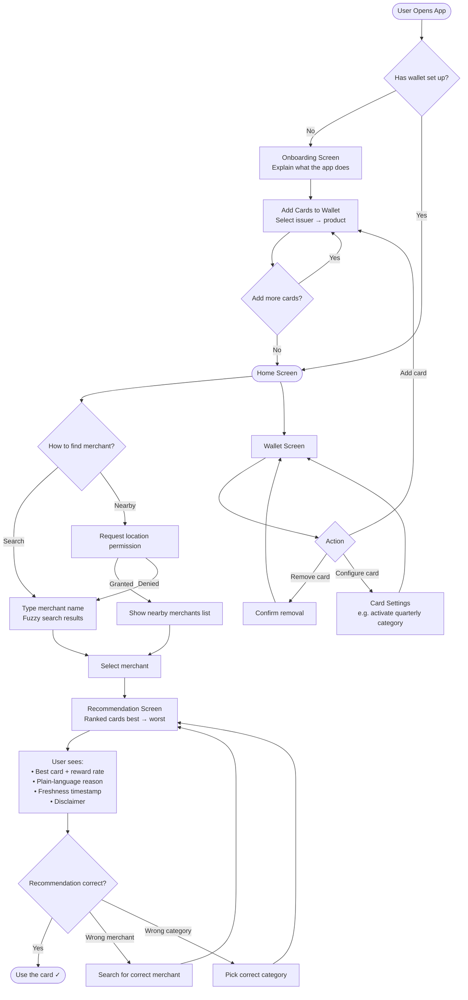
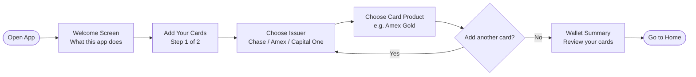
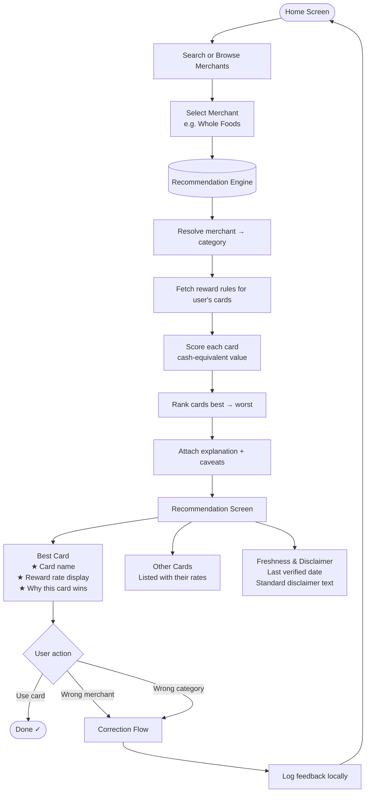
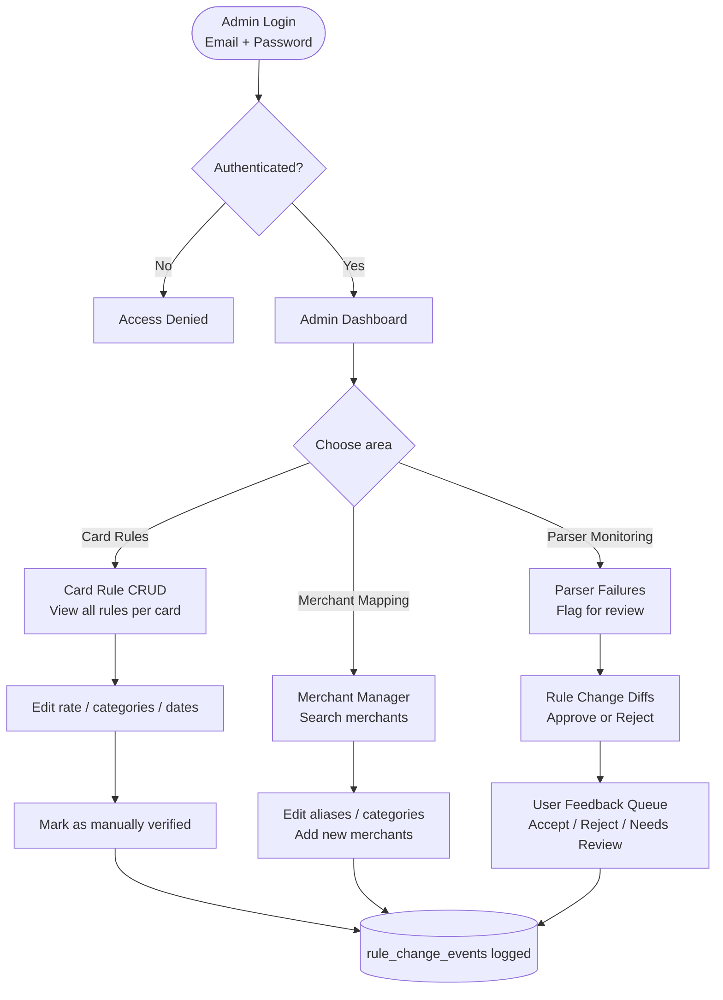
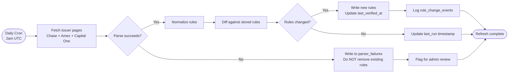

# Credit Card Advisor — High-Level User Flow

---

## 1. End-to-End Application Flow



---

## 2. First-Time User Flow (Onboarding)



---

## 3. Recommendation Flow (Core Loop)



---

## 4. Admin Flow



---

## 5. Rules Refresh Pipeline (Background)



---

## 6. State Summary

| Screen | Who sees it | Key action |
|---|---|---|
| Onboarding | New users only | Add cards to wallet |
| Home | All users | Search or browse merchants |
| Recommendation | All users | See ranked cards + explanation |
| Wallet | Authenticated users | Manage saved cards |
| Feedback/Correction | All users | Fix wrong merchant or category |
| Admin Dashboard | Admin only | Manage rules, merchants, parsers |

---

## 7. Data Flow Summary

```mermaid
flowchart LR
    U[User] -->|selects merchant| API[/api/recommend]
    API -->|merchant_id| E[Engine]
    E -->|lookup| DB[(Supabase DB)]
    DB -->|reward_rules| E
    DB -->|merchant + category| E
    E -->|ranked scores| API
    API -->|JSON response| U

    CRON([Daily Cron]) -->|fetch + parse| PIPE[Refresh Pipeline]
    PIPE -->|upsert rules| DB
    PIPE -->|log failures| DB

    ADMIN[Admin] -->|CRUD| ADMINAPI[/api/admin/rules]
    ADMINAPI -->|writes| DB
    DB -->|audit log| DB
```
